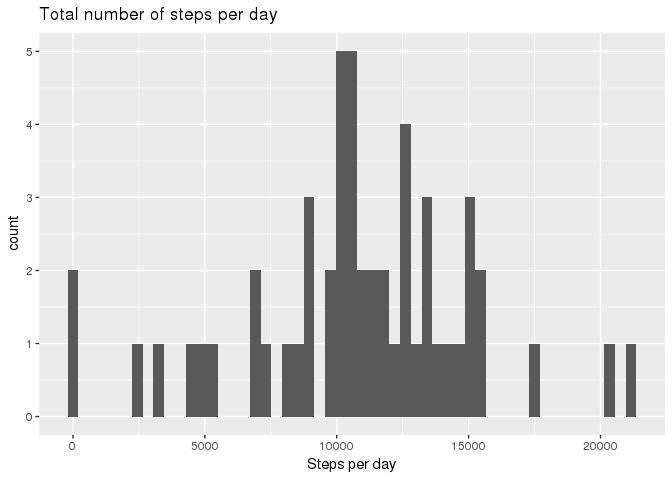

# Reproducible Research
David Martin  
May 11, 2017  


**Please note:** I was unable to knit the Rmd provided by the instructors, so I created a new one.  I believe there is a compatibility issue with the pandoc version used to generate the original Rmd from 3 years ago.  I can't tell if there is anything in that Rmd that is required for this assignment.  So here we go...


## Loading and preprocessing the data

Let's begin the project.


```r
library(dplyr, warn.conflicts = FALSE)
library(ggplot2)

setwd("/home/dmartin/R")
Activity <- read.csv("activity.csv", stringsAsFactors = FALSE)
```

The above is pretty straigt forward, load the libraries, set the working directory and load the data file.  Let's take a quick look at the data.


```r
head(Activity)
```

```
##   steps       date interval
## 1    NA 2012-10-01        0
## 2    NA 2012-10-01        5
## 3    NA 2012-10-01       10
## 4    NA 2012-10-01       15
## 5    NA 2012-10-01       20
## 6    NA 2012-10-01       25
```

Each row contains the number of steps, the date of the sample, the interval which is a numeric representation of the time (ie. 730 is 7:30am)


```r
Activity <- Activity %>%
  mutate(date_time = strptime(date,format="%Y-%m-%d") +
                             (interval %% 100) * 60 +
                             ((interval %/% 100) * 3600))
```

Create a new column in date/time format for the date and interval data provided.  This will be used later on in the project.


## What is the mean total number of steps taken per day?


```r
DailyStats <- Activity %>%
                group_by(date) %>%
                filter(! is.na(steps)) %>%
                summarise(sum_per_day = sum(steps),
                          mean_per_day = mean(steps))
```

Create new data frame and summarize the steps (total steps and average) for each day.  We are asked to ignore missing steps data represented as NA.


```r
ggplot(DailyStats,aes(sum_per_day)) +
  geom_histogram(bins=nrow(DailyStats)) +
  labs(title="Total number of steps per day") +
  xlab("Steps per day")
```

<!-- -->

This is a histogram for the total number of steps taken per day.  From this we can see the average is somewhere around 10,000.  Let's find the **mean** and **median** from the data set.


```r
mean(DailyStats$sum_per_day)
```

```
## [1] 10766.19
```

```r
median(DailyStats$sum_per_day)
```

```
## [1] 10765
```


## What is the average daily activity pattern?

To find the average daily activity pattern, let's create a new data set.  Group activity by interval and compute the mean for each, and exclude missing data.


```r
AvgDailyPattern <- Activity %>% group_by(interval) %>%
  summarise(int_avg = mean(steps,na.rm=TRUE))
```

Next, create a new column with an adjusted time.  Recall that interval is a numeric representation of the time (ie. 730 = 7:30am).  This will keep the hour in place, but change the minutes to the portion of the hour (ie 730 becomes 750).


```r
AvgDailyPattern <- AvgDailyPattern %>%
  mutate(adj_interval = (interval %% 100) / 0.6 + ((interval %/% 100) * 100))
```

Now let's plot the data


```r
ggplot(AvgDailyPattern,aes(adj_interval,int_avg)) +
  geom_line() +
  labs(title="Average number of steps per interval, averaged across all days") +
  xlab("Hour of the day") + ylab("Average steps")
```

<!-- -->

Which 5-minute interval contains the most number of steps?


```r
AvgDailyPattern %>% filter(int_avg == max(int_avg))
```

```
## # A tibble: 1 × 3
##   interval  int_avg adj_interval
##      <int>    <dbl>        <dbl>
## 1      835 206.1698     858.3333
```

This would be **8:35am** with an average number of steps being about **206**.


## Imputing missing values

Note that there are a number of days/intervals where there are missing values (coded as NA). The presence of missing days may introduce bias into some calculations or summaries of the data.


```r
sum(is.na(Activity$steps))
```

```
## [1] 2304
```

The next thing we want to do is fill in these **2,304** missing values with the average number of steps across all available data for that time interval.  To do this, let's first create a function to lookup the average number of steps for a given time interval.


```r
look <- function(t) AvgDailyPattern$int_avg[AvgDailyPattern$interval == t]
```

Now, let's create a new data frame of the original data, create a new column called "newsteps" and fill these in with the average number of steps.


```r
ImputedActivity <- Activity

ImputedActivity$newsteps <- sapply(Activity$interval,look)
```

This first step may not make sense, but now we can replace the newsteps with the original steps where that data is available.  If it's not available, then keep the average that we filled in at first.


```r
ImputedActivity <- ImputedActivity %>%
  mutate(newsteps = ifelse(is.na(steps),newsteps,steps))
```

Let's summarize the data like we did before.


```r
ImputedDailyStats <- ImputedActivity %>%
  group_by(date) %>%
  summarise(sum_per_day = sum(newsteps))
```

Plot the new data set as a histogram, like we did before.


```r
ggplot(ImputedDailyStats,aes(sum_per_day)) +
  geom_histogram(bins=nrow(DailyStats)) +
  labs(title="Imputed number of steps per day") +
  xlab("Steps per day")
```

<!-- -->

Lastly, let's look at the **mean** and **median**.


```r
mean(ImputedDailyStats$sum_per_day)
```

```
## [1] 10766.19
```

```r
median(ImputedDailyStats$sum_per_day)
```

```
## [1] 10766.19
```

The mean is exactly the same as before, and the median is slightly different, in fact the same as the mean.

The biggest impact is the center of the histogram is much higher than the original data, while the data looks largely the same.


## Are there differences in activity patterns between weekdays and weekends?

Let's add a new column to the activity data frame called "weekend" which contains the value "Weekend" or "Weekday".  This value will be used in the faceted graph below.


```r
Activity <- Activity %>% mutate(weekend = ifelse(weekdays(date_time) == "Saturday" |
                                 weekdays(date_time) == "Sunday","Weekend","Weekday"))
```

Now we create a new data frame of weekday versus weekend activity and compute the average number of steps per interval, just like we did before.  We also adjust the time interval to account for the portion of the hour (ie. 730 becomes 750).


```r
WeekdayDailyPattern <- Activity %>% group_by(interval,weekend) %>%
  summarise(int_avg = mean(steps,na.rm=TRUE))

WeekdayDailyPattern <- WeekdayDailyPattern %>%
  mutate(adj_interval = (interval %% 100) / 0.6 + ((interval %/% 100) * 100))
```


```r
ggplot(WeekdayDailyPattern,aes(adj_interval,int_avg)) +
  geom_line() +
  facet_grid(~weekend) +
  labs(title="Weekday versus weekend average number of steps") +
  xlab("Hour of the day") + ylab("Average steps")
```

<!-- -->

On the weekend, it looks like significantly less activity in the morning, but a more rounded activity during the day and a little bit later activity past 8:00pm.


